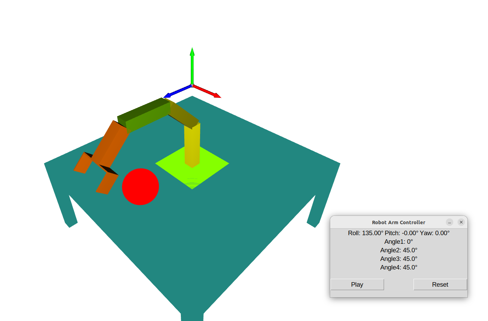

# Robotic Arm Simulation
Created a 4 DOF Arm including 4 revolute Joints. However, I have created another Arm including 3 joints.

## Key Concepts
### Visualization
To simulate the robotic arm, a 3D renderer tool is required. In this case, Python's **Open3D** is used to create the entire 3D simulation. Open3D does not have built-in animation functionality, so after moving each link of the arm, the previous link is deleted, and a new link is created at a new position calculated by **Forward Kinematics** (FK) and **Inverse Kinematics** (IK).

### Forward Kinematics
Forward kinematics can be implemented in various ways, such as using Denavit-Hartenberg (DH) parameters. However, a simpler approach using **Homogeneous Matrix Multiplication** is employed to calculate the position of the **End Effector**. Though computationally expensive, this approach is manageable by converting the link pose into a quaternion format.

### Inverse Kinematics
To pick an object on the table, the roll of the end effector should be set to 180 degrees. This implies that the sum of the angles of **Link2**, **Link3** and **Link4** must be 180 degrees, and the base rotational angle does not affect this. By multiplying the homogeneous matrices for each joint (**H1, H2, H3, H4, H5**), we get the final homogeneous matrix that corresponds to the end effector's position.

Simplifying the equations leads to four key equations:

1. eq1 = np.tan(np.radians(a1)) - (x / z)
2. eq2 = a2 + a3 + a4 - 180
3. eq3 = l2 * np.cos(np.radians(a2)) - l3 * np.cos(np.radians(a4)) - (y + l4 - l1)
4. eq4 = l3 * np.sin(np.radians(a4)) + l2 * np.sin(np.radians(a2)) - ((z / np.cos(np.radians(a1))) + l4)
These equations are solved numerically using initial guess.

A separate **Solver.py** function is implemented to compute the angles of the four joints based on these equations.

### Roll-Pitch-Yaw (RPY)
- **Roll**: Rotation around the x-axis. ψ=atan2(R21​,R11​)
- **Pitch**: Rotation around the y-axis.θ=atan2(−R31​,root(square(R32)​+square(R33)​)​)
- **Yaw**: Rotation around the z-axis. ϕ=atan2(R32​,R33​)

Where Rxy is the corresponding value from the **End Effector's Homogeneous Matrix**.

# Project File Structure
## project_root/

The root directory of the project contains the main files and subdirectories that are essential for the project.

### config/
- **Table.json**: Contains the configuration data related to the table setup.
- **Command.json**: Stores the command configurations used by the system.
- **ArmPose.json**: Stores the Joint Angles and End Effector Postion used by the system

### assets/

The assets directory contains Python scripts related to the creation of the table and the arm model.

- **CreateTable.py**: Script responsible for generating the table in the environment.
- **ArmModel.py**: Defines the 3D model structure of the robotic arm.

### Kinematics/

This directory contains Python scripts that handle the kinematic calculations for the robotic arm, including both forward and inverse kinematics.

- **FK.py**: Implements the forward kinematics for the robotic arm.
- **IK.py**: Implements the inverse kinematics for the robotic arm.
- **Solver3R.py**: Solves the kinematic equations for a 3R robotic arm (3 Revolute joints).
- 
### allPossiblePoints
It generates a graph of all possible end effector accessible points

### ControlPanel.py

A script that manages the user interface for interacting with the robotic system

### Environment.py

Sets up and simulates the environment where the robotic arm operates, including environmental parameters and interactions with the table and other objects.

### ArmController.py

Contains logic for controlling and animating the movements and behavior of the robotic arm, including sending control commands to the arm based on input from the environment or user.

### CollisionDetection.py

Implements algorithms to detect and handle collisions between the robotic arm and other objects in the environment.

### main.py

The entry point of the project. This script ties all components together, orchestrating the simulation or operation of the robotic system, including the control of the arm and the environment.

# User Guide for Robot Arm Control System

## System Requirements

- Python 3.x
- The following Python libraries:
  - `tkinter` (for GUI)
  - `open3d` (for 3D visualization)
  - `json` (for reading/writing JSON configuration files)
  - `threading` (for parallel processing)
  - `time` (for delays between actions)
  - `filelock` (for safe file access in multi-threaded environments)

## Steps to Run the Code

### 1. Install Dependencies

Ensure the required libraries are installed in your Python environment. You can install the necessary libraries using pip:

```bash
pip install open3d filelock
```

### 2. Prepare Configuration Files

The system uses JSON configuration files that store settings for the robot's arm, table, and commands. These files should be in the `config/` directory. Ensure the following files exist and are correctly formatted:

- `config/Command.json`: Stores the control commands such as play and reset status.
- `config/ArmPose.json`: Stores the current joint angles of the robot arm.
- `config/table.json`: Stores the dimensions of the table to be added to the scene.

### 3. Running the Code

The program consists of three main modules:

- **ControlPanel**: Handles the GUI for controlling the robot.
- **Environment**: Sets up the 3D environment and controls the robot's movements.
- **Main Application**: Starts the robot control in a separate thread and runs the GUI.

To run the program, simply execute the main Python file. Open a terminal and run:

```bash
python main.py
```

### 4. Understanding the GUI

When you run the program, a GUI window will appear with buttons to control the robot arm:

- **Play**: Start or pause the robot's movements.
- **Reset**: Reset the scene (clear all objects and restart the setup).

The GUI will display:

- **Roll, Pitch, Yaw**: The current orientation of the robot arm.
- **Angle1, Angle2, Angle3, Angle4**: The current joint angles of the robot arm.

The GUI allows you to control the robot via the Play and Reset buttons.

### 5. How It Works

- **Robot Movement**: The robot moves based on commands from the control panel. When you press the Play button, the robot will start performing pick-and-place tasks in the 3D environment.
- **Object Pick-and-Place**: The robot picks up and places objects at different positions in the 3D space. The pick-and-place operation checks for collisions before picking up an object to avoid errors.
- **Scene Reset**: Pressing the Reset button clears the 3D scene and resets the robot's arm.

### 6. Background Process

The code runs the robot in a background thread to handle pick-and-place actions. The robot continuously checks for command changes (`Play` or `Reset`) from the `Command.json` file. When the Play command is set to `-1`, the robot picks and places objects at predefined positions. When the Reset command is set to `-1`, the environment is cleared and reset.

### 7. Stopping the Program

To stop the program, simply close the GUI window or terminate the script in the terminal using `Ctrl+C`.

## Example Workflow

1. **Launch the Program**:
   - Execute `python main.py` to start the program.
   
2. **Control the Robot**:
   - Press **Play** to start the robot's pick-and-place operations. The robot will move objects at predefined positions.
   - Press **Reset** to clear and reset the scene.

3. **Monitor the Arm's Status**:
   - The GUI will show real-time updates for the arm's joint angles and orientation (Roll, Pitch, Yaw).
